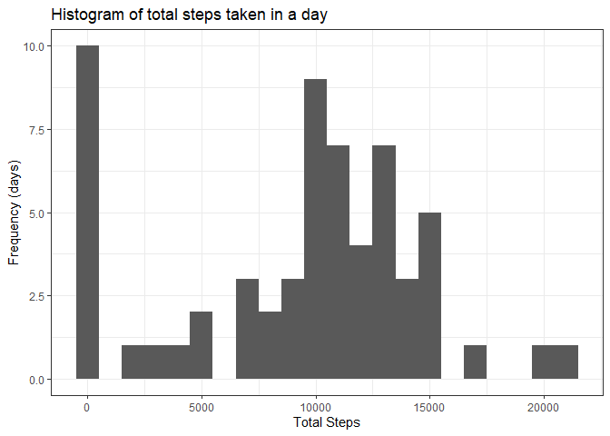
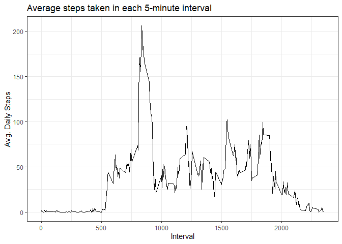
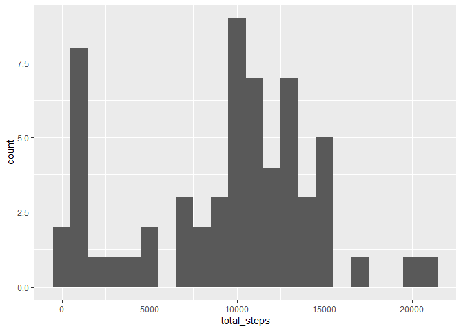
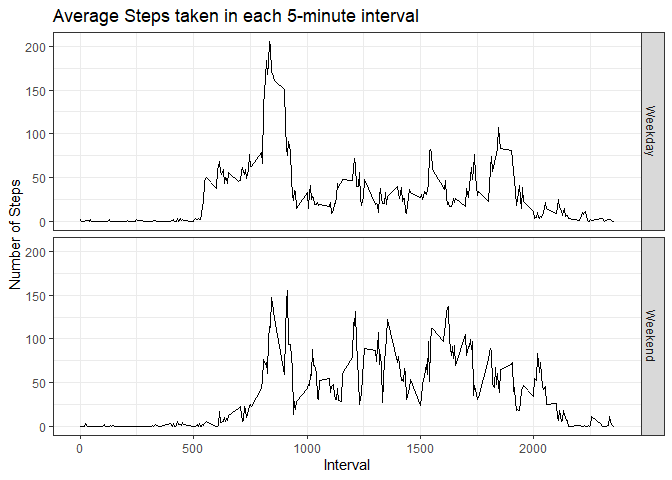

## Loading and preprocessing the data


```r
library(dplyr)
library(tibble)
library(data.table)
library(ggplot2)
library(knitr)
library(kableExtra)
library(impute)
library(lubridate)
```


```r
# Check if file exists and download it and unzip it if it does not
if (!file.exists("zipped_data.zip")){
    download.file("https://d396qusza40orc.cloudfront.net/repdata%2Fdata%2Factivity.zip",
                  "zipped_data.zip")
    unzip("zipped_data.zip")
}

# load the data
activity <- as_tibble(fread("activity.csv"))
```


## What is mean total number of steps taken per day?

```r
# 1. Make a histogram of the total number of steps taken each day

# get total steps 
tsteps <- activity %>%
    group_by(date) %>%
    summarize(total_steps = sum(steps, na.rm = TRUE))

# histogram of total steps
hg <- ggplot(data = tsteps, mapping = aes(total_steps))
hg + 
    geom_histogram(binwidth = 1000) + 
    theme_bw() +
    labs(title = "Histogram of total steps taken in a day",
         x = "Total Steps",
         y = "Frequency (days)")
```

<!-- -->

```r
# table of mean and median total steps in a day
kable(
    tsteps %>%
        summarize(mean_daily_steps = round(mean(total_steps, na.rm=T), 2),
                  median_daily_steps = round(median(total_steps, na.rm = T), 2))
) %>%
    kable_styling(full_width = F)
```

<table class="table" style="width: auto !important; margin-left: auto; margin-right: auto;">
 <thead>
  <tr>
   <th style="text-align:right;"> mean_daily_steps </th>
   <th style="text-align:right;"> median_daily_steps </th>
  </tr>
 </thead>
<tbody>
  <tr>
   <td style="text-align:right;"> 9354.23 </td>
   <td style="text-align:right;"> 10395 </td>
  </tr>
</tbody>
</table>


## What is the average daily activity pattern?

### 1. Make a time series plot (i.e. type = "l") of the 5-minute interval (x-axis)
and the average number of steps taken, averaged across all days (y-axis)

```r
steps_interval <- activity %>%
    group_by(interval) %>%
    summarize(avg_daily_steps = mean(steps, na.rm = T))

sg <- ggplot(data = steps_interval, mapping = aes(interval, avg_daily_steps))

sg +
    geom_line()+ 
    theme_bw() +
    labs(title = "Average steps taken in each 5-minute interval",
         x = "Interval",
         y = "Avg. Daily Steps")
```

<!-- -->

```r
# 2. Which 5-minute interval, on average across all the days in the dataset,
# contains the maximum number of steps?
steps_interval[which.max(steps_interval$avg_daily_steps),]
```

```
## # A tibble: 1 x 2
##   interval avg_daily_steps
##      <int>           <dbl>
## 1      835            206.
```


## Imputing missing values

1. Calculate and report the total number of missing values in the dataset
(i.e. the total number of rows with NAs)  

```r
sum(is.na(activity$steps))
```

```
## [1] 2304
```

```r
mean(is.na(activity$steps))
```

```
## [1] 0.1311475
```


2. Devise a strategy for filling in all of the missing values in the dataset. The
strategy does not need to be sophisticated. For example, you could use
the mean/median for that day, or the mean for that 5-minute interval, etc.  

```r
activity %>%
    group_by(date) %>%
    summarize(total = n(),
              missing = sum(is.na(steps)))
```

```
## # A tibble: 61 x 3
##    date       total missing
##    <date>     <int>   <int>
##  1 2012-10-01   288     288
##  2 2012-10-02   288       0
##  3 2012-10-03   288       0
##  4 2012-10-04   288       0
##  5 2012-10-05   288       0
##  6 2012-10-06   288       0
##  7 2012-10-07   288       0
##  8 2012-10-08   288     288
##  9 2012-10-09   288       0
## 10 2012-10-10   288       0
## # ... with 51 more rows
```

```r
# it would appear that days that have any missing values are fully empty. 
# imputing missing values by mean/median on a day would not work based on that
# we will instead impute by median for that interval
interval_medians <- activity %>%
    group_by(interval) %>%
    summarize(int_med = median(steps, na.rm = T))

# this is somewhat naive and zero-skewed as the median is oftentimes zero for an 
# interval, but mean will always be above zero which is not practical either.
```


3. Create a new dataset that is equal to the original dataset but with the
missing data filled in.  


```r
activity_nomissing <- activity %>%
    inner_join(interval_medians) %>%
    mutate(steps = ifelse(is.na(steps), int_med, steps)) %>%
    select(date, interval, steps)
```

```
## Joining, by = "interval"
```


4. Make a histogram of the total number of steps taken each day and Calculate
and report the mean and median total number of steps taken per day. Do
these values differ from the estimates from the first part of the assignment?
What is the impact of imputing missing data on the estimates of the total
daily number of steps?  


```r
tsteps_nomissing <- activity_nomissing %>%
    group_by(date) %>%
    summarize(total_steps = sum(steps))

ag <- ggplot(tsteps_nomissing, mapping = aes(total_steps))

ag + geom_histogram(binwidth = 1000) 
```

<!-- -->

```r
kable(
    tsteps_nomissing %>%
        summarize(mean_daily_steps = round(mean(total_steps, na.rm=T), 2),
                  median_daily_steps = round(median(total_steps, na.rm = T), 2))
) %>%
    kable_styling(full_width = F)
```

<table class="table" style="width: auto !important; margin-left: auto; margin-right: auto;">
 <thead>
  <tr>
   <th style="text-align:right;"> mean_daily_steps </th>
   <th style="text-align:right;"> median_daily_steps </th>
  </tr>
 </thead>
<tbody>
  <tr>
   <td style="text-align:right;"> 9503.87 </td>
   <td style="text-align:right;"> 10395 </td>
  </tr>
</tbody>
</table>

We see that the median has been unchanged (since all values were imputed from 
medians) but that the mean has increased (since missing values were removed and
therefore treated as zero). 

The impact on imputation is that total steps will increase since NA's are 
removed in prior calculations and now are being included.


## Are there differences in activity patterns between weekdays and weekends?

For this part the weekdays() function may be of some help here. Use the dataset
with the filled-in missing values for this part.
1. Create a new factor variable in the dataset with two levels – “weekday”
and “weekend” indicating whether a given date is a weekday or weekend
day.


```r
activity_nomissing <- activity_nomissing %>%
    mutate(wkday = weekdays(date)) %>%
    mutate(weekpart = as.factor(
        ifelse(wkday == "Saturday" | wkday == "Sunday",
               "Weekend",
               "Weekday"))) %>%
    select(weekpart, date, interval, steps)
```


2. Make a panel plot containing a time series plot (i.e. type = "l") of the
5-minute interval (x-axis) and the average number of steps taken, averaged
across all weekday days or weekend days (y-axis).


```r
wkpt_agg <- activity_nomissing %>%
    group_by(weekpart, interval) %>%
    summarize(avg_steps = mean(steps))
```

```
## `summarise()` has grouped output by 'weekpart'. You can override using the `.groups` argument.
```


```r
wg <- ggplot(wkpt_agg, mapping = aes(interval, avg_steps))

wg + 
    geom_line() + 
    theme_bw() + 
    facet_grid(rows = vars(weekpart)) + 
    labs(title = "Average Steps taken in each 5-minute interval",
         x = "Interval",
         y = "Number of Steps")
```

<!-- -->

There are two noticeable patterns that can be observed when we compare weekday 
and weekend activity:
1. Activity seems to start and end later in the day on weekends vs weekdays
2. There seems to be slightly higher average steps throughout the day on 
weekends vs. weekdays
